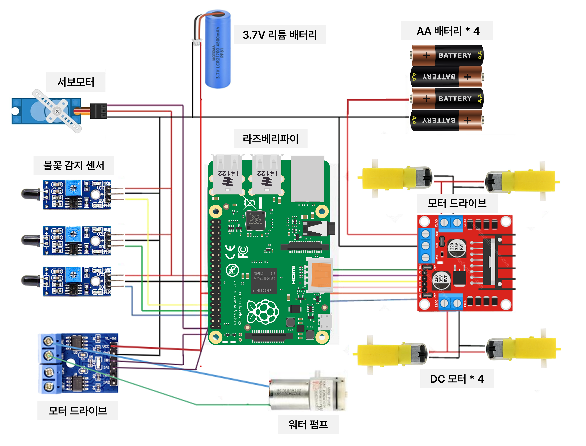
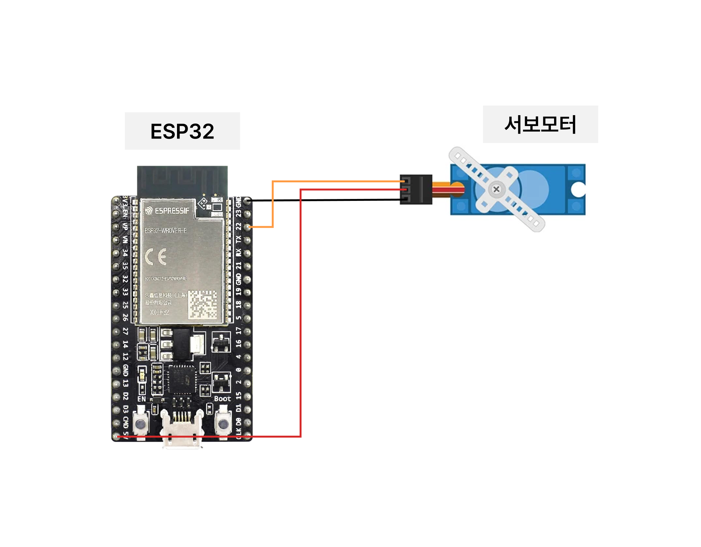
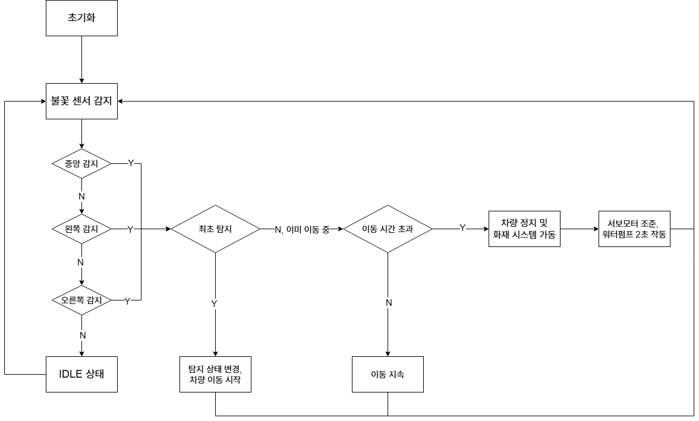

# 🤖 자동 소방 RC카 및 스마트 도로 통제 시스템

라즈베리파이와 ESP32-CAM을 기반으로, 화재를 초기에 자동으로 진압하는 소방 RC카와 원활한 출동을 위한 스마트 도로 통제 시스템

***

## 👨‍💻 팀원 및 역할 분담

| 이름 | 주요 역할 |
| :-- | :-- |
| **곽윤지** | • RC카 하드웨어 제작   • 바퀴 구동 및 이동 로직 구현   • 전체 시스템 센서 통합 및 제어 로직 개발 |
| **박수정**| • 워터펌프 및 서보모터를 이용한 자동 방수 시스템 구현   • 발표 및 프로젝트 자료 취합 |
| **신유진** | • RC카 하드웨어 제작   • 불꽃 감지 센서를 이용한 화재 인식 기능 구현   • ESP32와 Edge AI를 활용한 소방 RC카 자동 감지 기능 개발 |

***

## ✨ 주요 기능

### 🚒 자동 소방 RC카
* **불꽃 탐지**: 불꽃 센서를 통해 왼쪽, 중앙, 오른쪽 방향의 불꽃을 감지
* **자동 이동**: 불꽃의 위치에 따라 로봇이 직진, 좌회전, 우회전
* **불 진압**: 불꽃이 감지되면 서보 모터로 방향을 조준하고 물 펌프를 작동
* **상태 기반 동작**:
    * **IDLE**: 대기 상태
    * **SEEKING**: 불꽃 탐지 및 이동
    * **ATTACKING**: 불꽃 진압

### 🚦 스마트 도로 통제 시스템
* **차단봉 자동 제어**: Edge AI가 소방 RC카의 출동을 인식하면 교차로의 차단봉을 자동으로 제어하여 신속한 이동 경로 확보

***

## 🔧 회로도 및 순서도

### 회로도 (Circuit Diagram)

### 순서도 (Flowcharts)

***

## 🛠️ 시스템 구성

### 하드웨어 구성
* **라즈베리 파이 (Raspberry Pi 4 Model B)**: RC카의 메인 컨트롤러. 센서 데이터 종합 후 전체 동작(탐색, 이동, 공격) 결정 및 명령
* **ESP32-CAM**: 스마트 도로 통제 시스템의 영상 인식 장치. Edge AI를 이용해 RC카를 감지하고 차단봉 제어 신호 전송
* **불꽃 감지 센서 (Flame Sensor)**: 왼쪽, 중앙, 오른쪽 방향의 불꽃 감지
* **L298N 모터 드라이버**: RC카 바퀴의 DC 모터 구동 및 제어
* **서보 모터 (Servo Motor)**: 감지된 불꽃 방향으로 조준
* **워터 펌프 & L9110 드라이버**: 펌프를 작동시켜 실제로 물을 분사하여 불을 진압
* **18650 리튬 배터리**: 전원을 공급

### 소프트웨어 및 개발 환경
* Python
* Arduino IDE
* VSCode & SSH

### 📂 소스 코드
**자동 소방 RC카 (라즈베리파이)**
  - [main code](https://github.com/yunjikwak/EmbeddedProject/blob/eec6f975b79aa0480d9df58a13f389daeebe7993/embedded/prototype/testWaterFlame.py)

***

## 🎬 시연 영상

***

## 📚 참고 프로젝트 (reference)
* **ESP32 Object Detection Tutorial**: [dronebotworkshop.com/esp32-object-detect](https://dronebotworkshop.com/esp32-object-detect/)
* **DIY Fire Fighting Robot using Arduino | Auto Fire Chaser and Extinguisher**: [YouTube 링크](https://youtu.be/jsvAL9ogFBw?si=kDti-TN0ViefoNBD)
* **Fire Fighting Robot using Arduino | Full Project Tutorial**: [YouTube 링크](https://youtu.be/6rAVhszhOGw?si=NS4qRY2XxnBTSWw1)
